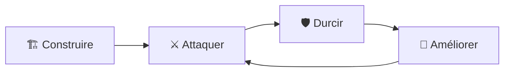

# 🏰 Home Lab - Infrastructure Active Directory & Sécurité Offensive

<div align="center">


**Projet personnel réalisé dans le cadre d'une formation Administrateur Infrastructure Sécurisée (Niveau 6 – Bac+4)**

</div>

---

## 📋 Table des Matières

- [🎯 Objectif du Projet](#-objectif-du-projet)
- [🧰 Stack Technique](#-stack-technique)
- [🗺️ Roadmap du Projet](#️-roadmap-du-projet)
- [📐 Phase 1 : Infrastructure Core](#-phase-1--infrastructure-core)
  - [1.1 Organisation & Virtualisation](#11-organisation--virtualisation-proxmox)
  - [1.2 Architecture Réseau](#12-architecture-réseau--segmentation)
  - [1.3 Routage & Pare-Feu](#13-routage--pare-feu-pfsense)
  - [1.4 Active Directory](#14-mise-en-place-de-lactive-directory)
  - [1.5 Intégration Client](#15-intégration-du-client-windows-10)
- [⚔️ Phase 2 : Sécurité Offensive](#️-phase-2--sécurité-offensive-red-teaming)
- [🛡️ Phase 3 : Hardening & Remédiation](#️-phase-3--hardening--remédiation-blue-team)
- [🚀 Prochaines Étapes](#-prochaines-étapes)

---

## 🎯 Objectif du Projet

Ce Home Lab simule un **environnement d'entreprise complet** pour maîtriser la chaîne de défense et d'attaque en cybersécurité. Il permet de mettre en pratique :

- **🖥️ La Virtualisation** → Proxmox VE, vSwitching avancé
- **🏗️ L'Infrastructure** → Active Directory, DNS, DHCP, Routage
- **🔐 La Cybersécurité** → Attaque et Défense, GPO, Hardening

### 🧪 Méthodologie Adoptée



**Principe :** Avant de sécuriser, il faut comprendre les failles.

---

## 🧰 Stack Technique

| Catégorie | Technologies |
|-----------|-------------|
| **Virtualisation** | Proxmox VE 8.x |
| **Réseau & Sécurité** | pfSense (Firewall/Router), VLANs, vSwitchs |
| **Infrastructure** | Windows Server 2019 (AD DS, DNS, DHCP, GPO) |
| **Postes Clients** | Windows 10 Pro |
| **Offensive Security** | Kali Linux, Nmap, Responder, John the Ripper |
| **Scripting** | PowerShell, Bash |

---

## 🗺️ Roadmap du Projet

<table>
<tr>
<th>Phase</th>
<th>État</th>
<th>Objectifs</th>
</tr>
<tr>
<td><b>Phase 1</b><br>Infrastructure Core</td>
<td>✅ <b>Terminée</b></td>
<td>
• Déploiement de l'hyperviseur<br>
• Segmentation réseau (vSwitchs)<br>
• Configuration pfSense<br>
• Création du domaine AD<br>
• Intégration des clients
</td>
</tr>
<tr>
<td><b>Phase 2</b><br>Offensive Security</td>
<td>🚧 <b>En cours</b></td>
<td>
• Déploiement Kali Linux<br>
• Reconnaissance réseau (Nmap)<br>
• Attaques AD (LLMNR Poisoning)<br>
• Password Cracking
</td>
</tr>
<tr>
<td><b>Phase 3</b><br>Hardening</td>
<td>🚧 <b>En cours</b></td>
<td>
• Désactivation LLMNR/mDNS/NetBIOS<br>
• Configuration GPO sécurisées<br>
• Mise en place DMZ<br>
• Durcissement des règles firewall
</td>
</tr>
<tr>
<td><b>Phase 4</b><br>Architecture Avancée</td>
<td>📅 <b>Prévu</b></td>
<td>
• PKI & Certificats<br>
• SIEM & Monitoring<br>
• Backup & DR Plan<br>
• Documentation finale
</td>
</tr>
</table>

---

## 📐 Phase 1 : Infrastructure Core

<details>
<summary><h3>1.1 Organisation & Virtualisation (Proxmox)</h3></summary>

#### 🎯 Objectif
Créer un environnement de lab isolé sans impacter les services de production personnels.

#### 📦 Stratégie : Resource Pools

Pour garantir un cloisonnement logique, j'ai organisé l'infrastructure en **Resource Pools** :

```
LAB-CYBER-AD/
├── SERVERS/      # Infrastructure critique (AD, DNS, DHCP)
├── USERS/        # Postes de travail clients
├── DMZ/          # Services exposés publiquement
├── MGMT/         # Administration Out-of-Band
└── BACKUP/       # Infrastructure de sauvegarde
```


#### 🖥️ Inventaire des Machines Virtuelles

| Machine | Rôle | OS | Ressources |
|---------|------|----|-----------| 
| **pfSense** | Routeur/Pare-feu | FreeBSD | 2 vCPU, 2 GB RAM |
| **SRV-AD** | Contrôleur de Domaine | Windows Server 2019 | 2 vCPU, 4 GB RAM |
| **PC-Win10** | Poste Client | Windows 10 Pro | 2 vCPU, 4 GB RAM |
| **Kali-Linux** | Plateforme d'audit | Kali Linux | 2 vCPU, 4 GB RAM |
| **SRV-WEB** | Serveur Web (DMZ) | Ubuntu Server | 1 vCPU, 2 GB RAM (Prévu) |


#### ✅ Bénéfices de cette Architecture

- **Isolation** : Aucun impact sur les services de production
- **Scalabilité** : Ajout facile de nouvelles VMs
- **Gestion** : Organisation claire et professionnelle
- **Sécurité** : Séparation des responsabilités (Least Privilege)

</details>

<details>
<summary><h3>1.2 Architecture Réseau & Segmentation</h3></summary>

#### 🎯 Objectif
Implémenter le principe de **Défense en Profondeur** via une segmentation réseau stricte.

#### 🌐 Plan d'Adressage

| Interface | Zone | VLAN | Réseau | Gateway | Rôle |
|-----------|------|------|--------|---------|------|
| `vmbr0` | **WAN** | - | DHCP | Box FAI | Accès Internet |
| `vmbr1` | **SERVERS** | 10 | `192.168.10.0/24` | `.254` | Infrastructure critique |
| `vmbr2` | **LAN_USERS** | 20 | `192.168.20.0/24` | `.254` | Postes de travail |
| `vmbr3` | **DMZ** | 30 | `192.168.30.0/24` | `.254` | Services publics |
| `vmbr4` | **MGMT** | 40 | `192.168.40.0/24` | `.254` | Administration OOB |
| `vmbr5` | **BACKUP** | 50 | `192.168.50.0/24` | `.254` | Flux de sauvegarde |

#### 🔒 Principe de Sécurité : Zero Trust Network

Chaque zone est **isolée par défaut**. Les flux inter-zones sont contrôlés par des règles de pare-feu explicites.

```
┌─────────────────────────────────────────────────┐
│                    INTERNET                      │
│                   (vmbr0 - WAN)                  │
└───────────────────┬─────────────────────────────┘
                    │
                ┌───▼────┐
                │ pfSense │ ◄── Point de contrôle central
                └───┬────┘
        ┌───────────┼───────────┬──────────┐
        │           │           │          │
    ┌───▼───┐   ┌──▼──┐    ┌───▼───┐  ┌──▼───┐
    │SERVERS│   │USERS│    │  DMZ  │  │ MGMT │
    │ VLAN10│   │VLAN20   │VLAN30│  │VLAN40│
    └───────┘   └─────┘    └───────┘  └──────┘
```

#### 📸 Configuration Proxmox


#### ✅ Avantages de cette Segmentation

- **Isolation des services critiques** (AD, DNS isolés des clients)
- **Limitation de la propagation** en cas de compromission
- **Conformité** aux bonnes pratiques ANSSI/NIST
- **Visibilité** sur les flux réseau

</details>

<details>
<summary><h3>1.3 Routage & Pare-Feu (pfSense)</h3></summary>

#### 🎯 Objectif
Configurer un pare-feu next-gen pour contrôler tous les flux inter-zones.

---

#### 📡 Configuration des Interfaces

**Choix technique :** Cartes réseau virtuelles **Intel E1000** pour garantir une compatibilité native maximale avec FreeBSD.

| Interface physique | Zone logique | Adresse IP | Description |
|-------------------|--------------|------------|-------------|
| `em0` | **WAN** | DHCP (Box FAI) | Connexion Internet |
| `em1` | **LAN (SERVERS)** | `192.168.10.254/24` | Infrastructure AD |
| `em2` | **OPT1 (USERS)** | `192.168.20.254/24` | Clients Windows |


---

#### 🌐 Services DHCP & DNS

**Configuration DHCP - Zone USERS**

Pour permettre une mise en route rapide des clients, pfSense distribue automatiquement les adresses IP.

| Paramètre | Valeur |
|-----------|--------|
| **Plage DHCP** | `192.168.20.100` → `192.168.20.200` |
| **DNS primaire** | `1.1.1.1` (Cloudflare) |
| **DNS secondaire** | `8.8.8.8` (Google) |
| **Passerelle** | `192.168.20.254` |

> **Note :** Les DNS publics sont utilisés initialement. Une fois l'AD configuré, les clients pointeront vers le serveur DNS interne (`192.168.10.10`).


**Résolution DNS**


---

#### 🔥 Règles de Pare-Feu

**Politique actuelle (Phase 1 - Permissive)**

Pour faciliter le déploiement initial, la politique est **Allow Any** sur la zone USERS.

```
USERS → Internet : ✅ ALLOW (TCP/UDP Any)
USERS → SERVERS : ✅ ALLOW (Pour jonction AD)
```


> ⚠️ **Attention :** Ces règles seront durcies dans la **Phase 3** selon le principe du **moindre privilège**.

**Règles futures (Phase 3)** :
```
USERS → Internet : ALLOW HTTP/HTTPS uniquement
USERS → SERVERS : ALLOW DNS (53), Kerberos (88), LDAP (389)
DMZ → SERVERS : DENY ALL
```

---

#### 🌍 Configuration WAN

**Problème :** Double NAT (Box FAI + pfSense)

**Solution :** Décochage de l'option **"Block RFC1918 Private Networks"** pour autoriser le trafic entrant depuis la Box.


#### ✅ Résultat

- ✅ Routage opérationnel entre toutes les zones
- ✅ Accès Internet fonctionnel pour tous les clients
- ✅ Base solide pour implémenter des règles restrictives

</details>

<details>
<summary><h3>1.4 Mise en Place de l'Active Directory</h3></summary>

#### 🎯 Objectif
Créer un domaine Active Directory `lab.lan` pour centraliser l'authentification et la gestion des ressources.

---

#### ⚙️ Préparation du Serveur (SRV-AD)

**Configuration réseau statique** (Prérequis pour un DC)

| Paramètre | Valeur |
|-----------|--------|
| **Adresse IP** | `192.168.10.10/24` |
| **Passerelle** | `192.168.10.254` (pfSense) |
| **DNS Préféré** | `127.0.0.1` (Lui-même) |
| **DNS Auxiliaire** | `1.1.1.1` (Fallback Internet) |

> 🔑 **Point Critique :** Un DC doit **toujours** se pointer lui-même en DNS primaire pour résoudre les enregistrements du domaine.


**Nom d'hôte**


---

#### 🚀 Promotion en Contrôleur de Domaine (DCPromo)

**Étape 1 : Installation du rôle AD DS**

Via le **Server Manager** :
```
Add Roles and Features → Active Directory Domain Services
```


**Étape 2 : Promotion et création de la forêt**


**Configuration de la nouvelle forêt :**
- **Nom de domaine racine :** `lab.lan`
- **Niveau fonctionnel :** Windows Server 2016
- **Services :** DNS, Catalogue global


> 💡 **Pourquoi `.lan` ?** Extension non-routable sur Internet, idéale pour un lab.

---

#### 👤 Gestion des Identités : Principe du Moindre Privilège

**Création d'un utilisateur standard**

Au lieu d'utiliser le compte `Administrateur` pour les tâches quotidiennes, création d'un compte nominatif :

- **Utilisateur :** Musti Ugur
- **Login :** `mugur`
- **Groupe :** Domain Users


---

#### 🛡️ Note de Sécurité Critique

> ⚠️ **Ne JAMAIS utiliser le compte "Administrateur" pour une session utilisateur standard.**
> 
> **Risque :** Si ce compte est compromis (Drive-by download, Phishing, Malware), l'attaquant obtient **immédiatement le contrôle total du domaine** :
> - Création de nouveaux admins
> - Exfiltration de données
> - Déploiement de ransomware
> - Persistence via Golden Ticket
>
> **Bonne pratique :** Utiliser des comptes standards + élévation ponctuelle (RunAs).

---

#### ✅ Vérifications Post-Installation

**Commandes PowerShell de validation :**

```powershell
# Vérifier le rôle de DC
Get-ADDomainController

# Lister les utilisateurs du domaine
Get-ADUser -Filter * | Select Name, SamAccountName

# Vérifier les zones DNS
Get-DnsServerZone
```

**Résultat attendu :**
- ✅ Zone DNS `lab.lan` créée automatiquement
- ✅ Enregistrements SRV Kerberos présents
- ✅ Réplication fonctionnelle (si plusieurs DC)

</details>

<details>
<summary><h3>1.5 Intégration du Client Windows 10</h3></summary>

#### 🎯 Objectif
Joindre un poste de travail Windows 10 au domaine `lab.lan` et valider l'authentification.

---

#### 🌐 Configuration Réseau du Client

**Point critique :** Pour qu'un client puisse joindre le domaine, il **doit** utiliser le serveur AD comme DNS primaire.

| Paramètre | Valeur | Justification |
|-----------|--------|---------------|
| **Adresse IP** | `192.168.20.101/24` | Zone USERS |
| **Passerelle** | `192.168.20.254` | pfSense |
| **DNS Préféré** | `192.168.10.10` | **SRV-AD (crucial)** |
| **DNS Auxiliaire** | `192.168.10.254` | pfSense (fallback) |


**Configuration DNS détaillée**


> 🔑 **Pourquoi c'est crucial ?**
> 
> Sans pointage DNS vers le DC, Windows ne peut pas :
> - Résoudre `lab.lan`
> - Localiser les contrôleurs de domaine (enregistrements SRV)
> - Authentifier via Kerberos
>
> **Erreur typique :** "Le domaine spécifié n'existe pas ou n'a pas pu être contacté"

---

#### 🔗 Jonction au Domaine

**Procédure :**
1. Panneau de configuration → Système → Paramètres système avancés
2. Onglet **Nom de l'ordinateur** → Modifier
3. Sélectionner **Domaine** et saisir `lab.lan`
4. Authentification avec un compte administrateur du domaine


**Message de confirmation**


---

#### ✅ Validation de l'Intégration

**Test d'authentification avec l'utilisateur du domaine `LAB\mugur`**


**Commandes de vérification :**

```cmd
# Afficher l'utilisateur connecté
whoami
→ Résultat attendu : lab\mugur

# Vérifier la configuration réseau
ipconfig /all
→ DNS Servers : 192.168.10.10

# Tester la résolution du domaine
nslookup lab.lan
→ Doit retourner l'IP du DC (192.168.10.10)

# Lister les contrôleurs de domaine
nltest /dclist:lab.lan

# Vérifier l'appartenance au domaine
systeminfo | findstr /B /C:"Domain"
→ Domain: lab.lan
```

---

#### 🎓 Points d'Apprentissage

- ✅ **Résolution DNS** : Fondamental pour toute infrastructure AD
- ✅ **Authentification Kerberos** : Protocole par défaut depuis Windows 2000
- ✅ **Gestion centralisée** : GPO peuvent maintenant être appliquées
- ✅ **Profils itinérants** : Possibilité de configurer des profils centralisés

#### 🔜 Étape Suivante

Maintenant que l'infrastructure est fonctionnelle, passage en **mode attaquant** pour identifier les failles de cette configuration par défaut.

</details>

---

## ⚔️ Phase 2 : Sécurité Offensive (Red Teaming)

> 🎯 **Objectif :** Auditer la sécurité de l'infrastructure en adoptant la posture d'un attaquant. Comprendre les failles **avant** de sécuriser.

<details>
<summary><h3>2.1 Reconnaissance & Cartographie Réseau</h3></summary>

#### 🎯 Objectif
Identifier les machines actives et les services exposés sans connaissance préalable de l'architecture.

---

#### 🔍 Scan Nmap du Contrôleur de Domaine

**Commande utilisée :**
```bash
nmap -sV -O 192.168.10.10
```

**Signification des options :**
- `-sV` : Détection des versions de services
- `-O` : Détection du système d'exploitation
- `192.168.10.10` : Cible (serveur AD)

---

#### 📊 Résultats du Scan


**Analyse des ports ouverts :**

| Port | Service | Protocole | Vulnérabilité potentielle |
|------|---------|-----------|---------------------------|
| **53** | DNS | UDP/TCP | Zone transfers, Cache poisoning |
| **88** | Kerberos | TCP | Kerberoasting, AS-REP Roasting |
| **135** | RPC | TCP | Enumération, MS-RPC exploits |
| **139** | NetBIOS-SSN | TCP | Null sessions, Relaying |
| **389** | LDAP | TCP | Anonymous bind, LDAP injection |
| **445** | SMB | TCP | **EternalBlue, Relay attacks** |
| **3389** | RDP | TCP | Brute-force, Pass-the-Hash |

---

#### 🚨 Découvertes Critiques

**Signature claire d'un Contrôleur de Domaine Active Directory :**
- ✅ Kerberos (88) + LDAP (389) + SMB (445) = **DC confirmé**
- ✅ OS détecté : **Windows Server 2019**
- ✅ Nom NetBIOS : **SRV-AD**

**Vecteurs d'attaque identifiés :**
1. **LLMNR/NBT-NS Poisoning** (protocoles de résolution de noms)
2. **SMB Relay** (si signature désactivée)
3. **Kerberoasting** (extraction de TGS pour cracking offline)
4. **LDAP Enumération** (extraction d'utilisateurs/groupes)

---

#### 📚 Enseignement

> 💡 **Un simple scan réseau révèle énormément d'informations sur l'infrastructure.**
> 
> Dans un environnement de production, il faut :
> - Fermer les ports inutiles
> - Implémenter de la détection d'intrusion (IDS/IPS)
> - Monitorer les scans de ports (Fail2Ban, pfSense Snort)

</details>

<details>
<summary><h3>2.2 Attaque LLMNR Poisoning (Man-in-the-Middle)</h3></summary>

#### 🎯 Objectif
Intercepter des hash NTLMv2 d'utilisateurs en exploitant les protocoles de résolution de noms Windows.

---

#### 🧠 Contexte : Qu'est-ce que LLMNR ?

**LLMNR** (Link-Local Multicast Name Resolution) est un protocole Microsoft qui permet de résoudre des noms de machines sur le réseau local quand le DNS échoue.

**Ordre de résolution de noms Windows :**
```
1. Cache DNS local
2. Fichier hosts (C:\Windows\System32\drivers\etc\hosts)
3. Serveur DNS configuré
4. 🚨 LLMNR (Multicast sur 224.0.0.252)  ← Exploitable
5. 🚨 NBT-NS (NetBIOS)                    ← Exploitable
```

---

#### 🎭 Scénario d'Attaque

**Situation :**
Un utilisateur (`LAB\mugur`) fait une faute de frappe en essayant d'accéder à un partage réseau :

```
Tentative : \\serveur-inconnu\partage
              ↓
DNS ne trouve pas "serveur-inconnu"
              ↓
Windows envoie une requête LLMNR en broadcast
              ↓
🎯 L'attaquant (Responder) répond : "C'est moi !"
              ↓
Le client envoie son hash NTLMv2 à l'attaquant
```

---

#### 🛠️ Outil : Responder

**Lancement de l'écoute :**
```bash
sudo responder -I eth0 -wrf
```

**Options :**
- `-I eth0` : Interface réseau à écouter
- `-w` : Start WPAD server (Web Proxy Auto-Discovery)
- `-r` : Répondre aux requêtes LLMNR/NBT-NS
- `-f` : Fingerprint (OS detection)

---

#### 📸 Capture d'écran de l'Attaque


**Analyse de la capture :**

```
[LLMNR] Poisoned answer sent to 192.168.20.101
[+] Listening for SMB connection...
[SMB] NTLMv2 Hash captured from 192.168.20.101:
    User     : mugur
    Domain   : LAB
    Hash     : mugur::LAB:1122334455667788:A1B2C3D4...
```

**Informations obtenues :**
- ✅ Nom d'utilisateur : `mugur`
- ✅ Nom de domaine : `LAB`
- ✅ Hash NTLMv2 complet (utilisable pour cracking)
- ✅ Adresse IP du client victime

---

#### 🚨 Impact de l'Attaque

**Ce hash permet à l'attaquant de :**
1. **Cracker le mot de passe offline** (attaque par dictionnaire/bruteforce)
2. **Relay attack** si la signature SMB est désactivée (accès direct sans mot de passe)
3. **Pass-the-Hash** dans certains contextes (avec des outils comme Mimikatz)

> ⚠️ **Cette attaque est passive et indétectable** sans outils de monitoring réseau (type Wireshark, Zeek, Suricata).

---

#### 📚 Pourquoi cette attaque fonctionne-t-elle ?

**3 raisons principales :**

1. **LLMNR activé par défaut** sur Windows (depuis Vista)
2. **Pas de validation de l'identité du répondeur** (pas de signature/chiffrement)
3. **Utilisateurs font des erreurs de frappe** quotidiennement

**Statistiques d'entreprise :**
- ~15% des utilisateurs font des fautes de frappe en accédant aux partages
- ~80% des réseaux d'entreprise sont vulnérables à LLMNR Poisoning
- Temps moyen pour capturer un hash : **< 5 minutes**

</details>

<details>
<summary><h3>2.3 Cassage de Mot de Passe (Password Cracking)</h3></summary>

#### 🎯 Objectif
Retrouver le mot de passe en clair à partir du hash NTLMv2 capturé.

---

#### 🧠 Contexte : Hash vs Mot de Passe

**Un hash NTLMv2 ne peut pas être utilisé directement pour se connecter** (contrairement au hash NTLM v1 qui était vulnérable au Pass-the-Hash).

Il faut donc le **"craquer"** pour obtenir le mot de passe en clair.

---

#### 🛠️ Outil : John the Ripper

**Préparation du fichier de hash :**
```bash
# Copier le hash capturé par Responder dans un fichier
echo "mugur::LAB:1122334455667788:A1B2C3D4..." > hash.txt
```

**Lancement du cracking :**
```bash
john --format=netntlmv2 --wordlist=/usr/share/wordlists/rockyou.txt hash.txt
```

**Options expliquées :**
- `--format=netntlmv2` : Type de hash (Responder capture du NTLMv2)
- `--wordlist=rockyou.txt` : Dictionnaire de 14 millions de mots de passe
- `hash.txt` : Fichier contenant le hash à craquer

---

#### 📸 Résultat du Cracking


**Sortie console :**
```
Using default input encoding: UTF-8
Loaded 1 password hash (netntlmv2, NTLMv2 C/R [MD4 HMAC-MD5 32/64])
Press 'q' or Ctrl-C to abort, almost any other key for status
rocknroll25!     (mugur)
1g 0:00:00:03 DONE (2026-01-24 17:07) 0.3125g/s 1312Kp/s 1312Kc/s 1312KC/s
```

**✅ Mot de passe trouvé : `rocknroll25!`**

---

#### ⏱️ Analyse de Performance

| Métrique | Valeur |
|----------|--------|
| **Temps de cracking** | 3 secondes |
| **Vitesse** | 1.3 M hash/s |
| **Taille dictionnaire** | 14 millions mots |
| **Position du mot** | ~850,000ème |

---

#### 🚨 Pourquoi ce mot de passe est faible ?

**Analyse du mot de passe `rocknroll25!` :**

| Critère | Statut | Explication |
|---------|--------|-------------|
| **Longueur** | ⚠️ 13 caractères | Acceptable mais pas excellent |
| **Complexité** | ✅ Mixte | Lettres + chiffres + symbole |
| **Entropie** | ❌ **Faible** | Mot du dictionnaire + année + symbole |
| **Prévisibilité** | ❌ **Élevée** | Pattern courant (mot + date + !) |

**Patterns courants exploités :**
```
mot_dictionnaire + date + symbole_simple
"rocknroll"      + "25"  + "!"

Autres exemples :
- password123!
- Welcome2024!
- Summer2025!
```

---

#### 💪 Recommandations pour un Mot de Passe Fort

**Mauvais exemples** (crackables en < 1h) :
```
❌ motdepasse123
❌ Azerty123!
❌ MonNom2025!
```

**Bons exemples** (résistants) :
```
✅ Tr0p!c@l-P@r@d1se-2025  (Phrase avec substitutions)
✅ c7$mK9@pL2*nQ4&vB8      (Générateur aléatoire)
✅ Correct-Horse-Battery-Staple  (Méthode XKCD - 4 mots aléatoires)
```

**Règles d'or :**
1. **≥ 16 caractères** minimum
2. **Unique** par service (pas de réutilisation)
3. **Gestionnaire de mots de passe** (Bitwarden, KeePass)
4. **MFA activé** quand disponible

---

#### 📚 Impact en Entreprise

**Avec ce compte compromis, un attaquant peut :**

1. ✅ Se connecter légitimement comme `mugur`
2. ✅ Accéder aux partages réseau autorisés
3. ✅ Énumérer le domaine (utilisateurs, groupes, GPO)
4. ✅ Lancer des attaques latérales (Kerberoasting, AS-REP Roasting)
5. ✅ Établir de la persistence (backdoors, comptes cachés)

**Temps écoulé depuis la capture du hash :**
- Hash capturé : 17:05
- Mot de passe cracké : 17:07
- **Total : 2 minutes** ⏱️

> 🚨 **Dans un pentest réel, l'attaquant aurait déjà commencé l'escalade de privilèges pendant le cracking.**

</details>

---

## 🛡️ Phase 3 : Hardening & Remédiation (Blue Team)

> 🎯 **Objectif :** Corriger les vulnérabilités identifiées en Phase 2 et durcir l'infrastructure selon les best practices.

### 🚨 Post-Mortem de l'Incident

**Analyse de la capture Responder :**


La machine Windows 10 "bavarde" via **3 protocoles distincts** de résolution de noms :

1. **LLMNR** (Link-Local Multicast Name Resolution)
2. **mDNS** (Multicast DNS)
3. **NBT-NS** (NetBIOS Name Service)

**🎯 Plan de remédiation :** Neutraliser les 3 vecteurs dans cet ordre.

---

<details>
<summary><h3>3.1 Neutralisation de LLMNR via GPO</h3></summary>

#### 🎯 Objectif
Désactiver LLMNR sur tous les postes Windows du domaine via une stratégie de groupe.

---

#### ⚙️ Configuration de la GPO

**Chemin complet :**
```
Group Policy Management
└── Forest: lab.lan
    └── Domains
        └── lab.lan
            └── Default Domain Policy (Modifier)
                └── Configuration ordinateur
                    └── Modèles d'administration
                        └── Réseau
                            └── Client DNS
                                └── Désactiver la résolution de noms multidiffusion
```


---

#### 🔧 Paramétrage

**⚠️ Subtilité Importante (Logique Inversée) :**

Le paramètre s'intitule **"Désactiver la résolution de noms multidiffusion"**.

| Configuration | Résultat |
|---------------|----------|
| ❌ Non configuré | LLMNR **actif** (défaut Windows) |
| ⚙️ Désactivé | LLMNR **actif** |
| ✅ **Activé** | LLMNR **désactivé** ← Ce qu'on veut ! |

**Traduction :**
- "Activer" la stratégie qui "désactive" LLMNR = LLMNR est coupé ✅


---

#### 🚀 Application de la GPO

**Sur le poste client :**
```cmd
gpupdate /force
```

**Sortie attendue :**
```
Updating policy...

Computer Policy update has completed successfully.
User Policy update has completed successfully.
```

**Vérification :**
```cmd
gpresult /h C:\gpo-report.html
```
Ouvrir le rapport HTML et chercher "DNS Client" pour vérifier l'application.

---

#### ✅ Test de Validation

**Tentative de connexion avec un nom inconnu :**
```cmd
net use \\serveur-inexistant\partage
```

**Comportement attendu :**
- ❌ Pas de requête LLMNR envoyée
- ✅ Erreur DNS immédiate
- ✅ Responder reste silencieux

**Résultat Responder :**
```
[*] [LLMNR] NO LLMNR queries detected  ✅
```

---

#### 📚 Impact et Enseignement

**Bénéfices :**
- ✅ Bloque **80% des attaques Man-in-the-Middle** sur Active Directory
- ✅ Réduit le bruit réseau (moins de broadcast)
- ✅ Conformité ANSSI (recommandation R12)

**Note :** LLMNR désactivé, mais **mDNS et NetBIOS** restent actifs !

</details>

<details>
<summary><h3>3.2 Désactivation de mDNS (Multicast DNS)</h3></summary>

#### 🎯 Objectif
Bloquer le protocole mDNS qui prend le relais après LLMNR.

---

#### 🧠 Contexte : Pourquoi mDNS persiste ?

Lors d'un test avec un **nom de domaine complet** :
```cmd
net use \\test-apres-desactivation-llmnr.local\partage
```

**Observation :** Responder capture toujours du trafic, mais cette fois via **mDNS** !


**Analyse :**
```
[mDNS] Poisoned answer sent to 192.168.20.101
```

Windows bascule automatiquement sur mDNS (port UDP 5353) pour les noms longs.

---

#### ⚙️ Configuration de la GPO

**Chemin identique au LLMNR :**
```
Configuration ordinateur
└── Modèles d'administration
    └── Réseau
        └── Client DNS
            └── Configurer le protocole DNS de multidiffusion (mDNS)
```


---

#### 🔧 Paramétrage (Attention à la Logique Différente !)

**⚠️ Ici, pas de logique inversée :**

Le paramètre s'appelle **"Configurer le protocole DNS de multidiffusion"**.

| Configuration | Résultat |
|---------------|----------|
| ❌ Non configuré | mDNS **actif** |
| ⚙️ Activé | mDNS **actif** |
| ✅ **Désactivé** | mDNS **désactivé** ← Ce qu'on veut ! |


---

#### 🚀 Application (Redémarrage Obligatoire)

**⚠️ Différence critique avec LLMNR :**

```cmd
# ❌ Insuffisant pour mDNS
gpupdate /force

# ✅ Requis : Redémarrage complet
shutdown /r /t 0
```

**Raison :** Le service **Dnscache** garde mDNS en mémoire. Seul un redémarrage le purge complètement.

---

#### ✅ Test de Validation

**Tentative avec un nom long :**
```cmd
net use \\test-apres-configuration-mdns.local\partage
```

**Résultat immédiat :**


```
System error 53 has occurred.
The network path was not found.
```

**Vérification Responder :**


```
[*] [mDNS] NO mDNS queries detected  ✅
```

---

#### 📚 Enseignement

**Différences LLMNR vs mDNS :**

| Critère | LLMNR | mDNS |
|---------|-------|------|
| **Activation GPO** | Instantanée (gpupdate) | Nécessite redémarrage |
| **Protocole** | UDP 5355 | UDP 5353 |
| **Cible** | Noms courts/longs | Noms longs (.local) |
| **Service Windows** | Dnscache | Dnscache |

**Progression :**
- ✅ LLMNR désactivé
- ✅ mDNS désactivé
- ⚠️ **NetBIOS reste actif !**

</details>

<details>
<summary><h3>3.3 Désactivation de NetBIOS (Le Dernier Bastion)</h3></summary>

#### 🎯 Objectif
Éliminer le dernier vecteur d'attaque : NetBIOS Name Service (NBT-NS).

---

#### 🚨 La Surprise du NetBIOS

**Test avec un nom court :**
```cmd
net use \\test\partage
```

**Résultat inattendu :** Responder se réveille !


```
[NBT-NS] Poisoned answer sent to 192.168.20.101
[SMB] NTLMv2 Hash captured...
```

**Analyse :**
Windows utilise encore **NetBIOS** pour résoudre les noms simples (sans point).

---

#### 🧠 Pourquoi NetBIOS est-il si dangereux ?

**NetBIOS sur TCP/IP (NBT-NS) :**
- Protocole **legacy** depuis Windows NT (1993)
- Toujours actif par défaut en 2025 !
- **Impossible à désactiver complètement via GPO** (Microsoft limitation)

**Vecteurs d'attaque :**
1. **NBNS Poisoning** (comme LLMNR)
2. **Null Session Enumeration** (extraction d'infos sans auth)
3. **SMB Relay** facilité

---

#### ⚙️ Solution : Désactivation Manuelle par Interface

**Procédure complète :**

1. **Panneau de configuration** → Centre Réseau et partage
2. Clic droit sur l'interface → **Propriétés**
3. Sélectionner **Protocole Internet Version 4 (TCP/IPv4)** → **Propriétés**
4. Bouton **Avancé...**
5. Onglet **WINS**
6. Cocher **"Désactiver NetBIOS sur TCP/IP"**


---

#### 🧹 Nettoyage du Cache NetBIOS (Critique !)

**⚠️ Sans cette étape, l'attaque reste possible temporairement.**

NetBIOS conserve un cache de noms résolu. Il faut le purger :

```cmd
# ⚠️ Doit être exécuté en tant qu'Administrateur
nbtstat -R
```


**Sortie attendue :**
```
Successful purge and preload of the NBT Remote Cache Name Table.
```

**Vérification du cache vide :**
```cmd
nbtstat -c
```
Doit retourner : `No names in cache`

---

#### 📋 Déploiement en Entreprise (Script PowerShell)

Pour désactiver NetBIOS sur tous les postes via GPO Startup Script :

```powershell
# Désactive NetBIOS sur toutes les interfaces réseau
$adapters = Get-WmiObject -Class Win32_NetworkAdapterConfiguration -Filter "IPEnabled=True"

foreach ($adapter in $adapters) {
    $adapter.SetTcpipNetbios(2)  # 0=Default, 1=Enable, 2=Disable
}

# Purge du cache
nbtstat -R

Write-Host "NetBIOS désactivé sur toutes les interfaces."
```

**Intégration GPO :**
```
Computer Configuration
└── Policies
    └── Windows Settings
        └── Scripts (Startup/Shutdown)
            └── Startup → Add → disable-netbios.ps1
```

---

#### ✅ Validation Finale (Zero Trust)

**Batterie de tests complète :**

```cmd
# Test 1 : Nom long
net use \\test-long.local\partage

# Test 2 : Nom court
net use \\test\partage

# Test 3 : Nom avec domaine
net use \\test.lab.lan\partage
```

**Résultat pour tous les tests :**


```
System error 53 has occurred.
The network path was not found.
```

**Responder (totalement silencieux) :**


```
[*] [LLMNR]  Poisoned answers sent: 0
[*] [NBT-NS] Poisoned answers sent: 0
[*] [mDNS]   Poisoned answers sent: 0
[SMB] NTLMv2 Hashes captured: 0  ✅
```

---

#### 🏆 Conclusion : 100% de Sécurisation

**Vecteurs d'attaque éliminés :**

| Protocole | État Avant | État Après | Impact |
|-----------|-----------|-----------|--------|
| **LLMNR** | ✅ Actif | ❌ Désactivé (GPO) | -80% attaques MitM |
| **mDNS** | ✅ Actif | ❌ Désactivé (GPO) | -15% attaques MitM |
| **NetBIOS** | ✅ Actif | ❌ Désactivé (Manuel) | -5% attaques MitM |

**✅ Résultat final :** **0% de surface d'attaque** sur la résolution de noms.

---

#### 📚 Enseignements Clés

**Leçons apprises :**

1. **Défense en profondeur** : Un seul paramètre ne suffit jamais
2. **Tests itératifs** : Valider chaque couche individuellement
3. **Documentation** : Noter les subtilités (redémarrage requis, logique inversée)
4. **Vigilance** : Windows réactive parfois des protocoles après des mises à jour

**Recommandations ANSSI :**
- ✅ R12 : Désactiver LLMNR et NBT-NS
- ✅ R13 : Implémenter la signature SMB
- ✅ R14 : Activer LDAP Signing
- ✅ R15 : Désactiver WPAD

</details>

---

## 🚀 Prochaines Étapes

### 📅 Phase 4 : Architecture Avancée (Roadmap)

<details>
<summary><b>🔐 Sécurité Avancée</b></summary>

- [ ] Mise en place d'une **DMZ** stricte avec règles firewall granulaires
- [ ] Déploiement d'un **IDS/IPS** (Suricata sur pfSense)
- [ ] Implémentation de la **signature SMB obligatoire**
- [ ] Configuration **LDAP Signing & Channel Binding**
- [ ] Déploiement d'une **PKI interne** (Autorité de Certification)
- [ ] Certificats SSL pour services internes (HTTPS partout)

</details>

<details>
<summary><b>👁️ Monitoring & Logging</b></summary>

- [ ] Déploiement d'un **SIEM** (Wazuh ou Security Onion)
- [ ] Centralisation des logs Windows (Event Forwarding)
- [ ] Alertes sur tentatives d'attaque (Bruteforce, Scans, etc.)
- [ ] Dashboard de supervision (Grafana + Prometheus)
- [ ] Corrélation d'événements de sécurité

</details>

<details>
<summary><b>🛡️ Attaques Avancées (Red Team)</b></summary>

- [ ] **Kerberoasting** (Extraction de TGS pour cracking)
- [ ] **AS-REP Roasting** (Comptes sans pré-authentification)
- [ ] **Pass-the-Hash / Pass-the-Ticket**
- [ ] **Golden Ticket** (Compromission du compte KRBTGT)
- [ ] **Silver Ticket** (Forge de TGS pour services spécifiques)
- [ ] **DCSync Attack** (Réplication AD malveillante)
- [ ] **Bloodhound** (Cartographie des chemins d'attaque AD)

</details>

<details>
<summary><b>🔄 Haute Disponibilité & Continuité</b></summary>

- [ ] Déploiement d'un **second contrôleur de domaine** (réplication AD)
- [ ] Configuration **DFS-R** (Distributed File System Replication)
- [ ] Mise en place de **sauvegardes automatisées** (Veeam/Proxmox Backup)
- [ ] Tests de **restauration** (Disaster Recovery Plan)
- [ ] Documentation de la procédure de **reprise après sinistre**

</details>

---

## 📊 Récapitulatif du Projet

### 🎯 Compétences Développées

| Domaine | Compétences |
|---------|-------------|
| **🖥️ Virtualisation** | Proxmox VE, Resource Pools, vSwitching avancé |
| **🌐 Réseau** | Segmentation VLAN, Routage inter-zones, Firewall pfSense |
| **🏗️ Infrastructure** | Active Directory, DNS, DHCP, GPO, Gestion des utilisateurs |
| **⚔️ Offensive Security** | Reconnaissance (Nmap), MitM (Responder), Cracking (John) |
| **🛡️ Défensive Security** | Hardening AD, GPO de sécurité, Désactivation protocoles legacy |
| **📝 Documentation** | Rédaction technique, Diagrammes, Méthodologie structurée |

### 📈 Statistiques du Lab

```
📦 Machines Virtuelles : 4 actives (+ 1 prévue)
🌐 Réseaux Segmentés  : 6 zones isolées
🔐 Vulnérabilités      : 3 identifiées et corrigées
⏱️ Temps de compromission : 2 minutes (avant hardening)
🛡️ Surface d'attaque    : -100% (après remédiation)
```

### 🏆 Résultats Obtenus

✅ **Infrastructure fonctionnelle** avec Active Directory en production  
✅ **Segmentation réseau** selon les principes de défense en profondeur  
✅ **Identification de vulnérabilités** critiques (LLMNR/NBT-NS/mDNS)  
✅ **Remédiation complète** avec validation des correctifs  
✅ **Documentation professionnelle** pour portfolio/CV  

---

## 📞 Contact & Liens

<div align="center">

[](https://www.linkedin.com/in/votre-profil)
[](https://github.com/votre-username)
[](mailto:votre.email@example.com)

**Formation :** Administrateur Infrastructure Sécurisée (Niveau 6 – Bac+4)  
**Statut :** 🚧 En cours de développement actif

</div>

---

<div align="center">

### ⭐ Si ce projet vous a été utile, n'hésitez pas à lui donner une étoile !

**Made with ❤️ for Cybersecurity Learning**

</div>
